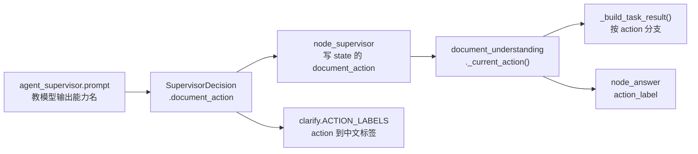
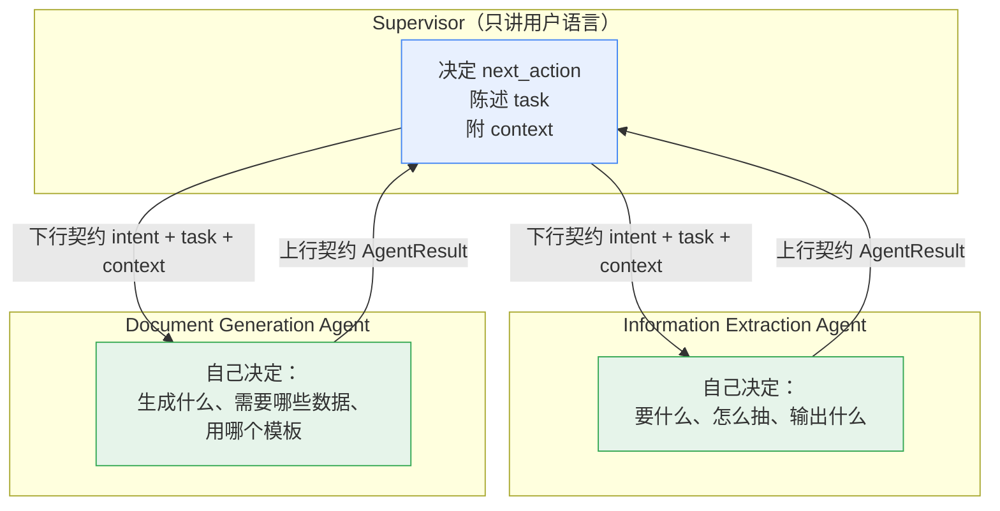

# Supervisor 契约改造：从"能力名"回到"用户目标"

> 这份文档回应你贴的那份建议。核心判断先说：**那条建议是对的，而且你现在的代码正好落在它
> 明确"不太建议"的那一类里**——`document_action` 就是把子 Agent 的内部动作名暴露给了
> Supervisor。下面给证据、给目标契约、给分阶段迁移方案。

---

## 0. 结论摘要

| 问题 | 结论 |
| --- | --- |
| 文档的建议对吗 | 对，而且方向和你上一轮"主 Agent 决策 + 子 Agent 按需持工具"是同一件事的两面 |
| 你现在符合吗 | 一级路由符合；**二级能力选择完全不符合**——`document_action` 正是文档说的"侵入子 Agent 内部编排" |
| 要改多少 | 下行契约 + 上行契约 + 动作决策归属，涉及 9 个文件（清单见附录） |
| 会不会更贵 | **不会**。文档建议的"新增一个 analyze 节点"会多一次模型调用；本方案把它并进子 Agent 现有的一次调用里，调用次数不变 |
| 迁移风险 | 低。三阶段，前两阶段纯增量、可回滚，评测跟着走 |

---

## 1. 对照分析：你现在处于文档说的哪个位置

### 1.1 逐条对照

| 维度 | 那份文档的建议 | 你现在的实现 | 判定 |
| --- | --- | --- | --- |
| Supervisor 输出什么 | `intent` + `task`（用户目标） | `next_action` + **`document_action`（能力名）** | ❌ 正是"不建议"形态 |
| 能力枚举归谁 | 只属于 Sub Agent | 同一套枚举**同时定义在 Supervisor 与 Document 两个 schema 里** | ❌ 双向耦合 |
| 谁决定"抽什么字段" | Sub Agent | Supervisor 定 `document_action`，子 Agent 只执行 | ❌ |
| Supervisor 提示词 | 只描述"让谁做" | 明确要求模型输出 `document_action=extract_mailing_address` | ❌ 耦合写进了提示词 |
| OCR MCP 只看不决策 | 是 | `ocr_client` 只识别 + 规范化 | ✅ |
| 领域规则不下沉到 MCP | 是 | `pick_mailing_address` 在子 Agent 侧 | ✅ |
| 多候选不许猜 | 是 | `pick_company` + `interrupt` | ✅ |
| 统一返回协议 | `AgentResult` | 无，靠共享 State 的隐式键名 | ❌ 上一轮已实测出 bug |

### 1.2 证据：一条链把 Supervisor 和子 Agent 焊死了

**证据 1 · 同一套枚举被定义了两遍**

```python
# app/agent/schemas/supervisor.py:8
DocumentAction = Literal["extract_mailing_address", "summarize_document",
                         "extract_company_info", "none"]

# app/agent/schemas/document.py:14
DocumentTaskAction = Literal["extract_mailing_address", "summarize_document",
                             "extract_company_info", "none"]   # ← 一模一样
```

同一个 `Literal` 在父 Agent 的 schema 和子 Agent 的 schema 里各写了一份。这不只是重复代码——
它意味着**父 Agent 的决策空间被绑死在子 Agent 的实现细节上**。

**证据 2 · 耦合被写进了提示词**

`prompts/agent_supervisor.prompt`：

```text
2. 有附件、并且用户原话已经说明要做什么时，第一次决策就要把任务类型一起给出：
   - 要邮寄地址：next_action=document，document_action=extract_mailing_address
   - 要总结：next_action=document，document_action=summarize_document
   - 要企业信息：next_action=document，document_action=extract_company_info
   （不要只给 document 让子 Agent 再猜一次用户想干什么。）
```

注意括号里那句——它是**故意的**取舍：作者当时为了"不让子 Agent 变成第二个意图识别器"，
主动把动作决策上提到了 Supervisor。这在只有 Document 一个子 Agent 时是划算的，
代价就是现在这种耦合。

**证据 3 · 一条消费链**



**这条链的代价**：子 Agent 想加第 4 种能力（比如"提取银行账户"），你要同时改
**Supervisor 的 schema、提示词、fallback 规则、中文标签表、评测数据集**——五处都在父 Agent 这边。
这正是那份文档说的"Supervisor 开始侵入 Sub Agent 的内部编排"。

---

## 2. 目标契约设计：一次改造，两个方向

### 2.1 下行契约：Supervisor → Sub Agent

```python
# app/agent/schemas/supervisor.py
NextAction = Literal[
    "knowledge",               # 查知识库
    "information_extraction",  # 从文件里取信息（原 document）
    "document_generation",     # 生成文档（原 application）
    "answer",                  # 直接组织回答
    "ask_user",                # 需要用户补充
]

class SupervisorDecision(BaseModel):
    next_action: NextAction
    task: str = Field(default="", description="一句话陈述'要帮用户完成什么'，用户视角，不得出现能力名")
    context: dict = Field(default_factory=dict, description="请求侧事实（文件 id、用户明确给出的值等）")
    reason: str = ""
    confidence: float = 0.0
    missing_info: list[str] = Field(default_factory=list)
```

对照文档给的例子：

```json
{"next_action": "information_extraction",
 "task": "从这份询证函中提取可用于寄送的地址",
 "context": {"document_id": "file_9f3c2a1b"}}

{"next_action": "document_generation",
 "task": "生成欣旺达公司的业务申请书",
 "context": {"company_name": "欣旺达"}}
```

**什么能进 `task` / `context`**——这条纪律要写进项目规范：

| ✅ 可以 | ❌ 不可以 |
| --- | --- |
| "提取这份询证函中可用于寄送的地址" | `extract_mailing_address` |
| "提取该公司核心工商信息" | `extract_company_info` |
| `context: {"document_id": "file_xxx"}` | `context: {"action": "summarize_document"}` |
| `context: {"company_name": "欣旺达"}` | `context: {"next_node": "node_prepare_document"}` |
| `task: "总结这份文档的重点"` | `task: "classify_document → extract_addresses"` |

判定标准一句话：**这里描述的是"用户要什么"；一旦出现你代码里的函数名、节点名、枚举值，就是越界。**

### 2.2 上行契约：Sub Agent → Supervisor

```python
# app/agent/schemas/agent_result.py（新增）
class AgentResult(TypedDict):
    status: Literal["success", "need_user_input", "failed"]
    task_type: str        # 子 Agent 自己决定的结果类型，供观测/日志，主 Agent 不 switch 它
    result: dict          # 结构化结果（地址 / 公司信息 / 摘要 / 文件）
    message: str          # 给用户看的话（需要用户输入时用它）
    artifacts: list       # 产物（DOCX 等）
```

**纪律**：主 Agent **不解析 `result` 的内部字段**，只按 `status` 决定"报结果 / 反问 / 报错"，
然后把 `result` 交给 `node_answer` 组织语言。

这一条同时修掉了上一轮实测出来的 `document_facts` 隐式契约 bug——有了显式出口之后，
子 Agent 之间就**不应该**再直接读对方的 State 键了。

### 2.3 两层契约的关系



一句话概括这套边界（沿用那份文档的措辞）：

```text
Supervisor   说的是「用户要什么」
Sub Agent    说的是「为了这个结果，我需要怎么理解和执行」
Tool / MCP   说的是「具体怎么执行」
```

每个 Agent 只能说自己那一层的语言，**跨层说别人的语言就是耦合**。

---

## 3. 关键设计决策：动作决策放哪，且不多花一次模型调用

拆掉 `document_action` 之后有个必须回答的问题：**"这份文件到底要抽地址还是抽公司信息"由谁定？**

三条路线：

| 路线 | 谁定动作 | 模型调用次数 | 评价 |
| --- | --- | --- | --- |
| A · 现状 | Supervisor | 1 | 耦合，违反文档原则 |
| B · 文档 §4 的 `analyze_extraction_task` | 子 Agent 新增节点 | **2**（analyze + extract） | 解耦，但每个文件多一次模型调用 |
| C · 折中（**推荐**） | 子 Agent，并入现有的单次理解调用 | **1** | 解耦且不增加成本 |

### 3.1 路线 C 怎么做

你现在 `document_service.understand_document()` 已经是**一次调用产出四件事**
（分类 + 8 个字段 + 地址候选 + 摘要）。把它扩成五件事即可：

```python
# app/agent/schemas/document.py
class DocumentUnderstanding(BaseModel):
    document_type: DocumentType
    confidence: float
    reason: str = ""
    fields: ExtractedDocumentFields
    addresses: list[AddressCandidate]
    summary: str = ""
    # 新增：子 Agent 自己决定本轮该执行哪个动作（不再由 Supervisor 指定）
    resolved_action: DocumentTaskAction = "none"
    # 新增：按用户目标裁剪后的输出（问什么答什么，不必把 8 个字段全抛给用户）
    task_result: dict = Field(default_factory=dict)
```

```python
# app/agent/services/document_service.py
def understand_document(text: str, task: str = "") -> DocumentUnderstanding:
    """一次调用完成：分类 + 字段 + 地址候选 + 摘要 + 本轮动作判定。"""
    prompt = load_prompt("document_understanding", text=_truncate(text, 8000), task=task or "（用户未说明）")
    ...
```

提示词侧加一段（`prompts/document_understanding.prompt`）：

```text
【用户目标】{task}

在完成上述理解的同时，判断本轮应该执行哪个动作，填入 resolved_action：
  extract_mailing_address / extract_company_info / summarize_document / none
判断依据只看"用户目标"，看不清就填 none。
```

于是：

- **调用次数不变**（还是 1 次 LLM + 1 次 OCR）；
- **动作决策回到了子 Agent 手里**，Supervisor 只传 `task`；
- 子 Agent 加能力时，只改自己的白名单 + prompt，**不动 Supervisor**。

### 3.2 为什么这不违反"子图不猜意图"

现在的 docstring 写着：

> 输入是一个**结构化任务**（`document_task = {file_id, action}`），子图不读用户原话、不猜意图。
> 传了它就会变成第二个意图识别器。

这个担心是合理的，但可以用**传 `task` 而不是 `raw query`** 来规避：

| 对比 | 传用户原话 | 传 Supervisor 消解后的 `task` |
| --- | --- | --- |
| 例子 | "帮我看看这个能寄哪儿啊？" | "从这份询证函中提取可用于寄送的地址" |
| 谁做意图识别 | 两边都做，且可能不一致 | 层级不同：Supervisor 做**路由级**判断（哪个域），子 Agent 做**动作级**映射（对应我哪个动作） |
| 指代/口语冗余 | 子 Agent 还得自己消解 | 已在 `task` 里消解过 |

关键是**层级不同，不是同一件事做两遍**。Supervisor 回答"该让谁做"，子 Agent 回答
"在我的能力里对应哪一个"——后者本来就只有子 Agent 有资格回答，因为那是它的内部白名单。

### 3.3 `_current_action` 的优先级改造（兼容期）

```python
def _current_action(state: dict) -> str:
    # 1. 子 Agent 自己判定的动作（新路径）
    # 2. 显式覆盖（测试 / 评测 / 老客户端仍在传 document_action）
    # 3. 无
    return (
        state.get("resolved_action")
        or state.get("document_action")
        or (state.get("document_task") or {}).get("action")
        or "none"
    )
```

这样在迁移期两条路并存，**现有测试与评测不会突然失败**，也能灰度对比两种方式的准确率。

---

## 4. 命名建议：让 Supervisor 说用户语言

| 现在 | 建议 | 理由 | 改动面 |
| --- | --- | --- | --- |
| `document` | `information_extraction` | `document` 既指"文件"又指"动作"，模型容易和"文档生成"混；新名字是纯用户语言 | `routing.py` 映射表、State 值、评测数据集 |
| `application` | `document_generation` | "申请书"是**当前唯一的**文档类型，不该写进路由名；将来加合同/报告不用改 | 同上 |
| `knowledge` | 保留 | 已经是用户语言 | — |
| `answer` / `ask_user` | 保留 | 同上 | — |

改动量实测：评测数据集 `intent_routing.json` 共 29 条，其中 5 条断言动作、
9 条 `expected` 是 `document` 或 `application`；前端只有 `ChatView.vue` 一处 label 映射。

**建议**：命名改造放到 P2 单独做（它只影响字面值，不影响行为），或者先只在提示词措辞上
往用户语言靠，代码里的枚举值晚一步再改。**不要和契约改造混在一次提交里**——
那样一旦评测掉分，你分不清是契约问题还是命名问题。

---

## 5. 迁移步骤（三阶段，每阶段可独立验证、可回滚）

### P0 · 契约共存（纯增量，不动现有行为）

| 改动 | 文件 |
| --- | --- |
| `SupervisorDecision` 增 `task` / `context`（可选，默认空） | `app/agent/schemas/supervisor.py` |
| 提示词增"同时用一句话陈述用户目标" | `prompts/agent_supervisor.prompt` |
| State 增 `document_task_text`（轮次级） | `app/agent/state.py` |
| 日志同时打印 `task` 与 `document_action`，便于比对 | `app/agent/supervisor.py` |

**验收**：现有 8 项 + 9 项自检全绿；跑 20~30 条真实请求，人工核对
`task` 是否准确表达了用户目标（这一步是后续所有改造的地基，值得花时间）。

### P1 · 责任移交

| 改动 | 文件 |
| --- | --- |
| `DocumentUnderstanding` 增 `resolved_action` / `task_result` | `app/agent/schemas/document.py` |
| `understand_document(text, task)` 并把 `{task}` 拼进提示词 | `app/agent/services/document_service.py`、`prompts/document_understanding.prompt` |
| `_current_action` 改成"resolved_action 优先，document_action 兜底" | `app/agent/subgraphs/document_understanding.py` |
| 子图出口写 `agent_result`（与既有键并行，先不删） | 两个子图的出口节点 |

**验收**：`document` 评测套件的动作准确率**不应下降**；两条路径的判定不一致率要统计出来
（这是最有价值的一个数字——它能告诉你"由子 Agent 决定"到底比"由 Supervisor 指定"好还是差）。

### P2 · 拆除耦合

| 改动 | 文件 |
| --- | --- |
| 从 `SupervisorDecision` 移除 `document_action`（或标 deprecated） | `app/agent/schemas/supervisor.py` |
| `fallback_decision` 改成产出 `task` 文本，不再产出能力名 | `app/agent/supervisor.py` |
| `clarify.ACTION_LABELS` / `node_answer` 改读 `resolved_action` | 两个节点 |
| 评测数据集去掉 `expected_document_action`，改断言 `task` | `evaluation/agent/` |
| 命名改造（可选） | 见第 4 节 |

**关于"自由文本怎么回归测试"**——这是个真问题，两个务实做法：

1. **LLM-as-judge**（项目里已有 `evaluation/judge.py` 可复用）：把 `task` 与用例的
   `expected_task` 交给裁判模型判断语义是否等价，输出 0/1。适合语义宽松的场景。
2. **评测专用影子映射**：只在评测里用一个归一化函数把 `task` 映射回能力名再比对。
   实现简单、结果稳定，但要注意**这个映射只存在于评测代码里，不许进生产路径**——
   否则耦合又从后门回来了。

推荐 2 先跑起来（当天就能有数），1 作为后续补充。

---

## 6. 契约守卫：防止耦合从后门回来

这类改造最大的风险不是"改不动"，而是**改完半年后被不知情地改回去**。加一个几十行的静态测试，
让 CI 替你守：

```python
# app/test/test_supervisor_contract.py
"""契约守卫：Supervisor 的 schema 不得出现任何子 Agent 的能力名 / 节点名。"""
import json

from app.agent.schemas.supervisor import SupervisorDecision

FORBIDDEN = {
    # Document 子图的能力名
    "extract_mailing_address", "summarize_document", "extract_company_info",
    # Application 子图的产物名
    "generate_business_application",
    # 两个子图的节点名（含中断点）
    "node_prepare_document", "node_understand_document", "node_confirm_address",
    "node_finalize_document", "node_parse_application_request", "node_resolve_company",
    "node_company_select", "node_prepare_application", "node_human_confirmation",
    "node_render_and_finalize",
    # 子图本身的节点名
    "document_skill", "application_skill",
}


def test_supervisor_schema_has_no_subagent_vocabulary():
    text = json.dumps(SupervisorDecision.model_json_schema(), ensure_ascii=False)
    hits = sorted(word for word in FORBIDDEN if word in text)
    assert not hits, f"Supervisor schema 出现了子 Agent 的词汇，说明耦合回来了：{hits}"
```

**我实测了当前的状态**（还没改造，所以它应该失败）：

```text
命中越界词: ['extract_company_info', 'extract_mailing_address',
            'generate_business_application', 'summarize_document']
守卫测试结果: FAIL（存在越界耦合）
```

这就是最直观的"病灶证据"——把这段测试加进 `app/test/`，P2 做完它会自动转 PASS。

---

## 7. 操作建议清单

**先做**

1. **P0 只加字段，不改行为**。`task` / `context` 先以可选字段形式存在，同时保留
   `document_action`，两边并行跑，用真实请求比对一致性。这一步零风险，而且能拿到决策依据。
2. **把契约守卫测试先加上**（第 6 节）。让它先红着，作为改造的目标。
3. **提示词改措辞**：即使代码枚举值暂时不变，也先把 `agent_supervisor.prompt` 里
   "要邮寄地址：`document_action=extract_mailing_address`" 这类**教模型说能力名**的句子，
   改成描述用户目标的自然语言。

**别做**

4. **不要一次性把 `document_action` 删掉**。评测数据集里 5 条断言它、自检里有 6 处引用它，
   一起改会让你分不清是契约问题还是回归。
5. **不要把命名改造和契约改造混在同一次提交**（第 4 节）。
6. **不要为了让流程继续而在子 Agent 里猜用户意图**。`resolved_action` 判定不出来就填 `none`，
   由主 Agent 反问——这条纪律和第 20 节"多候选不许猜公司"是同一个道理。

**顺手做**

7. 把 `resolved_action` / `agent_result` 一并写进 State 并打进日志，SSE 也推一份。
   没有观测，"子 Agent 自己决定"这件事是无法验收的。
8. 上一轮发现的 `document_facts` 未声明问题，正好在 P1（加 `agent_result` 出口）时一起修掉。

---

## 8. 和上一份设计的关系

两份文档是同一件事的两半，建议合并成一个"Agent 契约规范"：

| | 管什么 | 对应文档 |
| --- | --- | --- |
| **协议层**（本文） | 父子 Agent 之间**用什么语言说话**：下行 `intent + task + context`，上行 `AgentResult` | 本文 |
| **能力层**（上一份） | 每个 Agent **能看到哪些工具、按什么条件收窄** | `docs/按需工具接入设计.md` |

两者合起来才完整：**先约定说话方式，再约定能拿到的工具**。如果只做能力层，
子 Agent 有了工具却还在被父 Agent 指定动作；如果只做协议层，父 Agent 说对了语言，
子 Agent 却没有受控的能力边界。

---

## 附录 · 改动文件清单

| 阶段 | 文件 | 改动 |
| --- | --- | --- |
| P0 | `app/agent/schemas/supervisor.py` | 增 `task` / `context` |
| P0 | `prompts/agent_supervisor.prompt` | 增"陈述用户目标"要求；改掉教模型说能力名的句子 |
| P0 | `app/agent/state.py` | 增 `document_task_text`（轮次级） |
| P0 | `app/agent/supervisor.py` | 日志同时打印 task 与 action |
| P0 | `app/test/test_supervisor_contract.py`（新） | 契约守卫，先红后绿 |
| P1 | `app/agent/schemas/document.py` | `DocumentUnderstanding` 增 `resolved_action` / `task_result` |
| P1 | `prompts/document_understanding.prompt` | 增 `{task}` 变量与动作判定段 |
| P1 | `app/agent/services/document_service.py` | `understand_document(text, task)` |
| P1 | `app/agent/subgraphs/document_understanding.py` | `_current_action` 优先级；出口写 `agent_result` |
| P1 | `app/agent/subgraphs/business_application.py` | 出口写 `agent_result`；补声明 `document_facts` |
| P2 | `app/agent/schemas/supervisor.py` | 移除 `document_action` |
| P2 | `app/agent/supervisor.py` | `fallback_decision` 产出 task 文本 |
| P2 | `app/agent/nodes/clarify.py`、`nodes/node_answer.py` | 改读 `resolved_action` |
| P2 | `evaluation/agent/run_agent_eval.py` + `datasets/intent_routing.json` | 断言从 action 改为 task（影子映射或 judge） |
| P2 | `page/src/views/ai/ChatView.vue` | 路由名变更时的 label 映射（1 处） |
