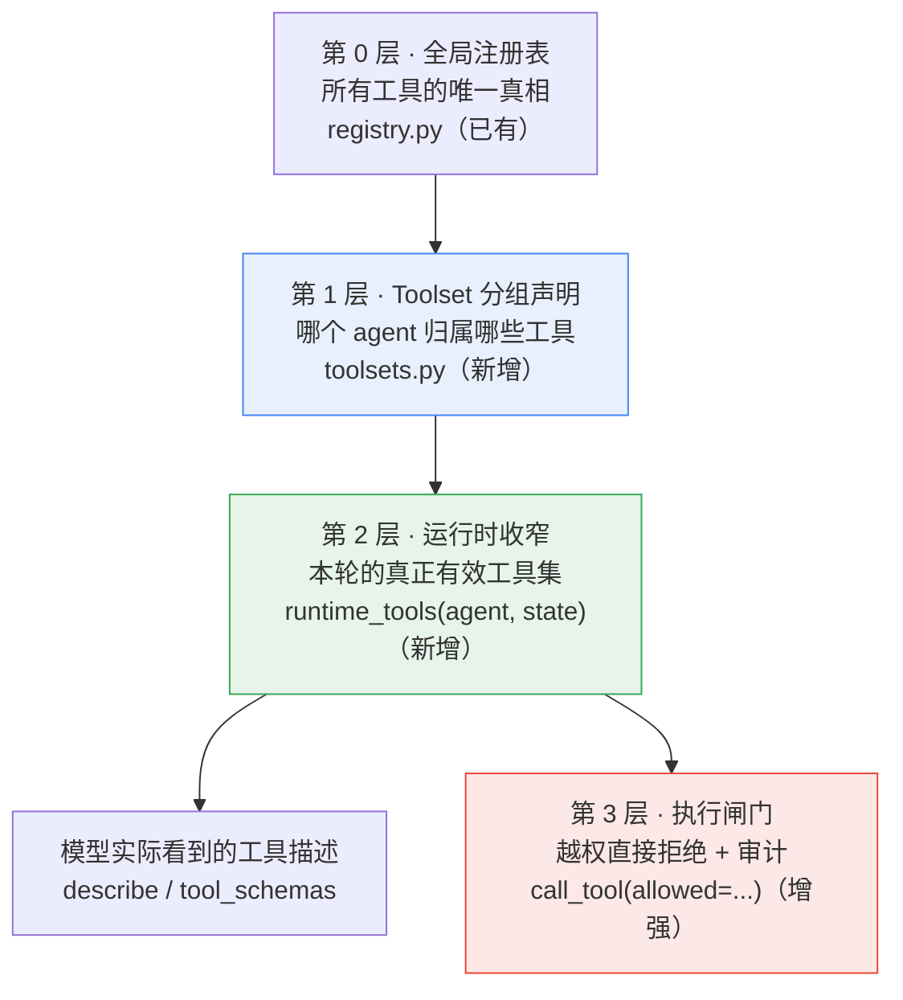
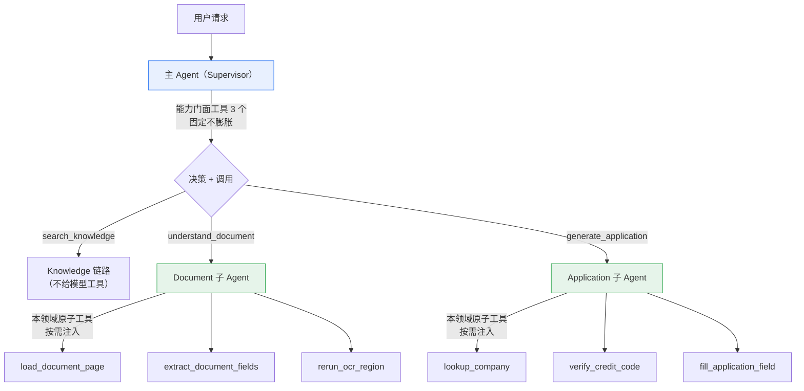

# 按需工具接入设计：主 Agent 决策/调用 + 子 Agent 按需持有工具

> 目标形态（对应你的设想）：**主 Agent 做决策与调用，子 Agent 只接入自己领域的特定工具，
> 且按需接入——不是所有工具都挂上去，避免专用子 Agent 功能膨胀。**
>
> 本文只给设计与落地路径，不改动现有编排结构。设计前提是四条约束：
> ① 现有确定性主图 / 子图不动；② HITL（interrupt / resume）不丢；
> ③ "企业事实不许猜"的护栏不丢；④ 离线自检与评测仍然跑得起来。

---

## 1. 核心模型：工具可见性的四层漏斗

不要指望"给模型一个函数就完事"。真正要设计的是**可见性**——同一批工具，谁在什么时候看得见。



四层各管一件事，缺一层都会退化成"把一堆工具全塞给模型"：

| 层 | 解决的问题 | 失败时的症状 |
| --- | --- | --- |
| 注册表 | 有哪些工具、schema 是什么 | 工具散落在各处，没有统一入口 |
| Toolset | **哪个 agent 能用什么** | 所有 agent 都看得到全部工具（你担心的膨胀） |
| 运行时收窄 | **这一轮真正需要哪些** | 模型看到一堆当下用不了的工具，白烧 token 还更容易幻觉调用 |
| 执行闸门 | **真调了怎么办** | 模型编出一个工具名/越权调用，没人拦 |

---

## 2. 工具归属：能力门面 vs 领域原子工具

这是整个设计里最关键的一个划分。你的设想里"主 Agent 做决策和调用"，落地时对应两种
完全不同粒度的工具：

| 归属 | 工具粒度 | 数量 | 例子 | 稳定性 |
| --- | --- | --- | --- | --- |
| **主 Agent** | **能力门面**（capability） | 固定 3 个 | `search_knowledge` / `understand_document` / `generate_application` | 几乎不变 |
| **Document 子 Agent** | 领域原子工具 | 3~5 个 | `load_document_page` / `extract_document_fields` / `rerun_ocr_region` | 随领域演进而增 |
| **Application 子 Agent** | 领域原子工具 | 3~5 个 | `lookup_company` / `verify_credit_code` / `fill_application_field` | 随领域演进而增 |
| **Knowledge 子 Agent** | 无 | 0 | 业务链路由子图自己跑 | — |



**为什么这样能防膨胀**：新增能力永远只动叶子。Document 子图加一个
`rerun_ocr_region`，主 Agent 看到的仍然只有 3 个门面工具；反过来主 Agent 加一个能力，
也只多一个门面，不会把领域细节泄进主 Agent 的 prompt。

**一个必须明确的边界**：主 Agent 的"调用"是指**调到子图**（能力级），不是允许它自己
拿着 OCR / 企业检索的细粒度工具乱调。否则子图的护栏（地址优选规则、HITL 确认、
企业事实只从 MCP 取）会被绕过——这条是整个设计的地基，不能让步。

---

## 3. Toolset 声明（新增 `app/agent/tools/toolsets.py`）

纯声明，不引入新框架，和现有 `BUILTIN_MCP_SERVERS` 的风格保持一致：

```python
"""工具集声明：哪个 agent 归属哪些工具（唯一配置处）。"""

# 工具集：语义分组，key 就是 toolset 名
TOOLSETS: dict[str, list[str]] = {
    "common": ["calculator", "current_time", "text_stats"],
    "capability": ["search_knowledge", "understand_document", "generate_application"],
    "document": ["load_document_page", "extract_document_fields", "rerun_ocr_region"],
    "application": ["lookup_company", "verify_credit_code", "fill_application_field"],
    "knowledge": [],  # 业务链路由子图自己跑，不给模型工具
}

# agent 名 -> 它能看到的 toolset（这就是可见性白名单）
AGENT_TOOLSETS: dict[str, list[str]] = {
    "supervisor": ["common", "capability"],       # 主 Agent：通用小工具 + 3 个能力门面
    "document_skill": ["document"],
    "application_skill": ["application"],
    "knowledge": ["knowledge"],
}


def resolve_toolset(agent: str) -> list[str]:
    """把一个 agent 声明的所有 toolset 摊平成工具名列表（去重、保序）。"""
    names: list[str] = []
    for toolset in AGENT_TOOLSETS.get(agent, []):
        for name in TOOLSETS.get(toolset, []):
            if name not in names:
                names.append(name)
    return names
```

**纪律**：`AGENT_TOOLSETS` 是白名单而不是建议。任何 agent 没声明的工具，模型既看不到、
也调不动（第 5 节的执行闸门兜底）。

---

## 4. 运行时按需收窄（`tools/service.py` 新增）

静态分组只做到"不是所有 tool 都接入"。要做到"**按需**"，还需要第二个漏斗：

```python
def runtime_tools(agent: str, state: dict) -> list[str]:
    """本轮的真正有效工具集 = 声明的 toolset ∩ 当下可用条件。"""
    return [name for name in resolve_toolset(agent) if _enabled(name, agent, state)]


def _enabled(name: str, agent: str, state: dict) -> bool:
    spec = get_tool(name)
    if spec is None:                       # 工具没注册（MCP 没探测成功）
        return False
    if spec.metadata.source == "mcp":      # MCP 工具：服务必须已启用且已配置
        entry = mcp_registry.get_server(spec.metadata.server)
        if entry is None or not entry.usable:
            return False
    condition = TOOL_CONDITIONS.get(name)  # 声明式的"什么时候才需要它"
    return condition is None or condition(state)
```

`TOOL_CONDITIONS` 用一组小函数表达"按需"，条件尽量写成**读 State 的纯函数**，可单测：

```python
TOOL_CONDITIONS = {
    # 有附件、且文档还没理解完，才需要翻页/重跑 OCR
    "load_document_page":  lambda s: bool(s.get("attachments") or s.get("document_file")),
    "rerun_ocr_region":    lambda s: s.get("document_error") == "ocr_empty_text",
    "extract_document_fields": lambda s: bool(s.get("document_text")),
    # 企业查询只在申请书的"选主体"阶段需要，选定后立刻收回
    "lookup_company":      lambda s: s.get("application_phase") in {"parsed", "company_resolved"},
    # 能力门面：知识链路只在没有文档结果时才给
    "search_knowledge":    lambda s: not s.get("document_analysis"),
    "understand_document": lambda s: bool(s.get("attachments")) and not s.get("document_processed"),
}
```

| 收窄维度 | 例子 | 收益 |
| --- | --- | --- |
| 工具是否已注册 | MCP 探测失败 → 不给 | 模型不会去调一个必然失败的工具 |
| 服务是否可用 | OCR MCP 未配置 → 不给 | 等价于"能力不可用"，比调用报错友好 |
| 特性开关 | MCP 服务开关 `MCP_SERVERS[slug].enabled` | 环境差异不影响模型行为 |
| 任务 / 阶段 | `application_phase` 变化后收回 `lookup_company` | 减少无效调用 |
| 数据条件 | 没有附件就不给 `load_document_page` | 省 token |
| 用户权限（可选） | 多租户 / 角色白名单 | 越权前置拦截 |

**关键点**：收窄必须发生在**构造模型输入之前**。这是"按需接入"和"事后报错"的分水岭——
前者省 token、少幻觉；后者只是把错误推给用户。

---

## 5. 执行闸门：越权拦截（`tools/service.py` 增强）

提示词约束只是"请求"，不是"权限"。模型可能幻觉出一个工具名，也可能把当前 agent
不该碰的工具写进去，所以调用侧必须再拦一道：

```python
def call_tool(name: str, arguments: dict | None = None, *, allowed: list[str] | None = None) -> dict:
    """统一调用入口。allowed 非空时按白名单拒绝越权调用。"""
    if allowed is not None and name not in allowed:
        logger.warning(f"[tools] 越权调用被拒绝：{name}（allowed={allowed}）")
        return {"ok": False, "tool": name, "error": f"当前 agent 无权调用工具：{name}"}
    ...
```

同时给工具加风险标记，让"有副作用的工具"走更严的路径：

| 标记 | 含义 | 处理 |
| --- | --- | --- |
| `read_only` | 只读（计算器、时间、文档字段抽取） | 直接执行 |
| `side_effect` | 有副作用（生成 DOCX、写库） | 强制二次确认或只允许子图内部调用，不对模型暴露 |
| `external` | 打外部服务（MCP / 联网） | 需要超时 + 降级 + 结果截断 |

`side_effect` 的工具建议**默认不进任何 agent 的 toolset**——DOCX 渲染、写记忆这类动作
是编排层的职责，交给模型自由触发风险太高。

---

## 6. 子图里怎么用上工具：L1 定点调用 / L2 受限循环

你现在的子图是**确定性节点序列 + 单点 `json_completion`**。要让它"能用工具"，
建议分两个层次做，不要一步跳到 ReAct：

### L1 · 定点调用（推荐先做）

在已有的节点里，满足条件时允许模型发起 **0~1 次**工具调用。可控、可测、好回滚：

```python
def node_understand_document(state: dict) -> dict:
    understanding = document_service.understand_document(state["document_text"])
    # 新增：缺表格/缺字段时，允许一次定点补能力
    if _needs_supplement(understanding):
        tools = runtime_tools("document_skill", state)
        decision = json_completion(
            ToolDecision,                       # {tool_calls: [...], reason: str}
            build_tool_prompt("document_supplement", state, tools),
            tag="document_tools",
        )
        if decision and decision.tool_calls:
            results = run_tool_calls(decision.tool_calls, allowed=tools)
            understanding = _merge_supplement(understanding, results)
    ...
```

### L2 · 受限循环（后续，需要时再做）

抽一个可复用的节点工厂，避免每个子图各写一套循环：

```python
# app/agent/tools/node.py（新增）
def make_tool_node(*, agent: str, prompt_name: str, max_rounds: int = 3):
    """造一个"装了本轮工具"的节点：模型调工具 → 结果回填 → 再决策，最多 max_rounds 轮。"""
```

三条硬约束：

1. **必须设 `max_rounds`**，思路和 `max_supervisor_turns` 完全一致——没有上限的
   工具循环就是不可控的自主 Agent；
2. **每轮重新计算 `runtime_tools`**（阶段会变，工具集该跟着收）；
3. **工具结果要截断 + 脱敏 + 计入 State**，别把 MCP 原始返回整段塞回 prompt。

---

## 7. MCP 的正确接法：包成语义工具，而不是把厂商原始工具给模型

这一条很容易踩坑。`register_mcp_tools()` 会把 MCP 服务的**厂商原始工具**注册成
`mcp__<服务>__<工具名>`，如果你直接把这些塞给模型，会同时丢掉三样东西：

| 直接给厂商原始工具 | 包成语义工具 |
| --- | --- |
| 模型看到厂商字段名（`file_base64` / `image_base64`），填参质量差 | 模型看到稳定的业务语义参数（`file_id`、`page`） |
| 绕过 `ocr_client` / `company_client` 的规范化与降级 | 规范化、降级、超时都在函数内部，模型无感 |
| 换厂商 = 工具 schema 变了 = 模型行为跟着变 | 换厂商只改声明，模型侧零变化 |
| 企业原始返回可能带内部字段，直接进 prompt | 返回值经过筛选与截断 |

**推荐做法**：把经过 adapter 的业务语义能力包成 `@tool`，MCP 只是它的实现细节：

```python
@tool(
    category="mcp",
    toolset="document",
    risk="read_only",
    args_schema=ExtractDocumentFieldsArgs,
    display_name="抽取文档字段",
)
def extract_document_fields(file_id: str) -> dict:
    """从已上传的附件里抽取结构化字段（内部走 OCR MCP，未配置时自动降级到 VL / MinerU）。"""
    ...
```

于是"按需接入"的粒度是**业务语义**，而不是厂商 API。
`register_mcp_tools()` 保留给 `/api/agent/toolbox/mcp?probe=true` 这类**调试与探索**用途，
不进模型可见清单。

**与官方 `MultiServerMCPClient` 的关系**：官方是"把所有 MCP 工具全量给模型任选"，
和你的"按域、按需"是相反的取向。你不需要换客户端——`builtin.py` 的声明字典已经承担了
`MultiServerMCPClient` 配置字典的角色。唯一缺的能力是 **stdio 传输**
（`client._build_server` 现在只有 `streamable_http` / `sse`），而 `agents.mcp` 里
已经有 `MCPServerStdio`，要接本地子进程型 MCP 时补一个分支即可。

---

## 8. 落地步骤（文件级）

| 阶段 | 文件 | 改动 | 说明 |
| --- | --- | --- | --- |
| **P0** | `tools/registry.py` | `ToolMetadata` 增加 `toolset` / `risk` 字段 | 纯增量，默认值不影响现有工具 |
| **P0** | `tools/toolsets.py`（新） | `TOOLSETS` + `AGENT_TOOLSETS` + `resolve_toolset` | 声明式，纯数据 |
| **P0** | `tools/service.py` | 新增 `runtime_tools` / `describe_tools_for_agent`；`call_tool(..., allowed=)` | 不改变现有签名（`allowed` 是可选关键字参数） |
| **P0** | `app/test/test_tool_registry.py` | 加"越权调用被拒绝""收窄后工具不可见"断言 | 离线可测，不联网 |
| **P1** | `tools/domain.py`（新） | 把 RAG / OCR / 企业检索包成 5~8 个语义工具 | 复用现有 service 函数，不重写逻辑 |
| **P1** | `nodes/node_supervisor.py` | prompt 里拼 `describe_tools_for_agent("supervisor", state)` | 只注入 3 个能力门面 |
| **P1** | `subgraphs/document_understanding.py` | 在 `node_understand_document` 接 L1 定点调用 | 单点接入，最容易验证 |
| **P2** | `tools/node.py`（新） | `make_tool_node()` 通用受限循环 | 多个子图复用 |
| **P2** | `state.py` | 新增 `active_tools` / `tool_trace` | 观测 + 前端展示 |
| **P2** | `evaluation/agent/` | 增加"工具可见性/越权"测试套件 | 对齐现有三套评测 |

**P0 完成即可验证你的设想的 80%**：主管能看到哪些工具、子 Agent 归属什么、越权调不动——
这些都是纯增量改动，不碰任何业务链路。

### 最小验证片段（P0 做完就能跑）

```python
from app.agent.tools import list_tools
from app.agent.tools.toolsets import AGENT_TOOLSETS
from app.agent.tools.service import runtime_tools, call_tool

# 主 Agent 只有通用工具 + 3 个能力门面；Document 子 Agent 只有文档域工具
print(runtime_tools("supervisor", {}))
print(runtime_tools("document_skill", {"attachments": [{"file_id": "f1"}]}))

# DOCX 渲染这类有副作用的工具不在任何 agent 的 toolset 里，模型调不动
print(call_tool("render_application_docx", {}, allowed=runtime_tools("application_skill", {})))
# -> {'ok': False, ..., 'error': '当前 agent 无权调用工具：render_application_docx'}
```

---

## 9. 观测与测试

**观测**（没有这个，排障会非常痛苦）：每轮把"给了哪个 agent 哪些工具"写进 State 并打日志：

```python
updates["active_tools"] = runtime_tools(agent, state)
logger.info(f"[tools] agent={agent} 本轮工具={updates['active_tools']}")
```

建议同时推一个 SSE 事件（复用 `agent/events.py` 的风格），前端能在调试面板看到。

**测试**（三条最关键的断言）：

1. **原子性**：`runtime_tools(agent)` 的返回集合 ⊆ `resolve_toolset(agent)`；
2. **越权拒绝**：`call_tool(name, allowed=其他 agent 的工具)` 必须返回 `ok=False`；
3. **收窄生效**：同一个 agent 在状态 A 与状态 B 下拿到的工具集不同
   （例如 `application_phase` 从 `parsed` 变成 `company_selected` 后 `lookup_company` 消失）。

---

## 10. 风险与纪律

1. **别混两套调用口径**。一个 agent 要么走 `json_mode` + 文本协议（项目现状，`llm.py`），
   要么走真 function calling（`tools=` / `bind_tools`）。混在一个 prompt 里，模型的输出
   会处于"既不是 JSON 也不是 tool_calls"的中间态，解析必然不稳定。
2. **工具描述是要花 token 的**。按需收窄本身就是省 token 的手段，但要把 `active_tools`
   的数量记进日志，否则收窄是否生效无从判断。
3. **任何循环都要有上限**。`max_rounds` 之于工具节点，等同于 `max_supervisor_turns`
   之于主图。
4. **工具返回值必须截断 + 脱敏**。MCP / 检索返回可能很大，也可能含内部字段。
5. **主 Agent 的工具列表也要固定**。你担心"专用子 Agent 功能膨胀"，同一逻辑反过来也成立：
   主 Agent 的列表一旦开始增长，它就会变成第二个什么都懂的大杂烩。
6. **业务护栏优先于灵活性**。知识问答 / 文档理解 / 申请书三条链路已经评测对齐，
   改造时应"新增工具节点"而不是"用工具重写子图"。

---

## 11. 一句话总结

把你的设想翻译成工程语言就是：

> **注册表（有哪些）→ Toolset（谁归属）→ 运行时收窄（这一轮给谁哪些）→ 执行闸门（调了也拦得住）**，
> 主 Agent 只持有能力门面，子 Agent 只持有本领域原子工具，MCP 藏在语义工具的实现里。

这样每一层都能单测，每一个 agent 的可见工具都是白名单推导出来的，
新增能力只动叶子、不动主干。
前者省 token、少幻觉；后者只是把错误推给用户。
