# 苏银助手 · 架构分析：流程框图 / 调用结构 / Tool 与 MCP / 大模型编排

> 本文基于 `dev-agent` 分支的实际代码（不是设计文档转述）。每条结论都标了文件位置，
> 可以直接点进去核对。文中所有框图用 Mermaid 描述，GitHub / Typora / VS Code 均可渲染。

---

## 0. 一句话结论

这是一个**"确定性 LangGraph 编排 + 单点结构化大模型调用"**的企业业务智能体，而不是
ReAct / function-calling 式的自主 Agent：

- **编排权在 Python**：LangGraph 的节点与条件边决定"下一步调用谁"；
- **大模型只在节点内部做一件事**（分类 / 抽取 / 改写 / 生成），输出被 Pydantic 强校验；
- **工具与 MCP 由代码硬编码调用**，模型从不自己选工具（工具箱已建好但尚未接进提示词）；
- 三块业务能力（知识问答 / 文档理解 / 业务申请书）以 **主图 + 两个子图** 的形式组装，
  知识问答直接复用老 RAG 全链路，"改造原则是新增为主、存量少动"。

---

## 1. 项目定位与技术栈

| 维度 | 内容 |
| --- | --- |
| 项目类型 | 银行内部企业级 RAG 知识库问答 + 多轮对话 Agent + 文档/申请书业务自动化 |
| 后端 | Python / FastAPI / LangGraph / LangChain / Pydantic |
| 检索 | Qdrant（稠密 + 稀疏双向量、RRF 混合检索）/ DashScope TextReRank 交叉编码器精排 |
| 存储 | MySQL（历史与记忆 Source of Truth）/ Redis（热缓存、抽取水位、分布式锁） |
| 模型 | OpenAI 兼容网关（DeepSeek / 千问）+ DashScope text-embedding-v4 / VL 多模态 |
| 文档解析 | 会话附件：外部 OCR MCP（唯一通路）；知识库导入：MinerU（PDF/Office）+ VL（图片） |
| 外部集成 | MCP（`openai-agents` 的 `MCPServerStreamableHttp`）/ 腾讯云 COS / SSE 流式输出 |
| 前端 | Vue 3 + Vite（`page/`），已有 `dist/` 构建产物 |

---

## 2. 目录结构与分层职责

```text
suyin-assistant/
├── app/
│   ├── api/                     ← HTTP 接入层
│   │   ├── query_server.py          老 RAG 服务入口（/query、/stream、/history）；挂载 agent 路由
│   │   ├── agent.py                 Agent 统一入口（/api/agent/chat|upload|state|files|tools）
│   │   └── import_file.py           知识库导入入口
│   ├── agent/                   ← ★ Agent 编排层（本次改造的主体，全部为新增文件）
│   │   ├── graph.py                 Main Agent 主图：编译 / HITL 恢复 / 对外返回结构
│   │   ├── supervisor.py            Supervisor 结构化决策 + 模型不可用时的规则兜底
│   │   ├── routing.py               条件路由 + 两道循环保护
│   │   ├── state.py                 统一 AgentState（父图 ⊇ 两个子图），含字段生命周期说明
│   │   ├── llm.py                   json_mode + Pydantic 的结构化调用封装
│   │   ├── events.py                Agent SSE 事件名 + emit 封装
│   │   ├── config_helpers.py        模型名解析
│   │   ├── nodes/                   Supervisor / Knowledge / Answer / AskUser / Clarify
│   │   ├── subgraphs/               Document 子图、Application 子图
│   │   ├── services/                ★ 能力实现层（RAG 复用 / 文档 / OCR / 企业 / DOCX / 附件 / 记忆桥）
│   │   ├── mcp/                     ★ MCP 声明 + 通用客户端 + 注册表 + 两个业务适配器
│   │   ├── tools/                   ★ 工具箱：注册表 / 内置小工具 / 统一入口 / HTTP 管理接口
│   │   └── schemas/                 SupervisorDecision / DocumentAnalysis / CompanyCandidate / ApplicationData
│   ├── rag/                     ← 领域流水线（存量，被 Agent 复用）
│   │   ├── import_process/agent/    导入流水线（7 节点 LangGraph）
│   │   ├── query_process/agent/     检索流水线（7 节点 LangGraph）
│   │   ├── query_process/retrieval/ 纯 Python 检索件：日期解析、Filter 构造、查询 Schema
│   │   └── graph/neo4j_util.py      知识图谱工具（占位/预留）
│   ├── memory/                  ← 三层记忆系统：短期(L1) / 长期(L2) / 实体索引(L3)
│   ├── llm/                     模型客户端（LLM/VL 双类型 + 向量 + 精排）
│   ├── conf/                    全部配置 dataclass（agent_config / retrieval_config / answer_config …）
│   ├── utils/                   token 预算、SSE 队列、任务埋点、Qdrant/Mongo 工具
│   └── test/                    离线自检脚本（含 Agent 框架 8 项、工具箱 8 项）
├── page/                        Vue3 前端（src/api/agent.js 为 Agent 客户端）
├── prompts/                     16 个提示词模板
├── templates/                   DOCX 申请书模板（江苏省版 / 其它地区版）
├── evaluation/                  检索评测 + Agent 三套评测（routing / company / document）
├── docs/agent-framework.md      改造说明与接入指南
├── output/ outputs/             导入中间产物 / Agent 附件与会话产物
└── scripts/                     模板生成脚本
```

**分层边界很清晰**：`nodes/` 只做状态读写与节点埋点，真正的能力都在 `services/`，
外部集成都在 `mcp/`，模型调用统一走 `llm.py` 或 `get_llm_client`。子图和节点都不直接碰数据库。

---

## 3. 图 1 · 整体分层架构与调用方向

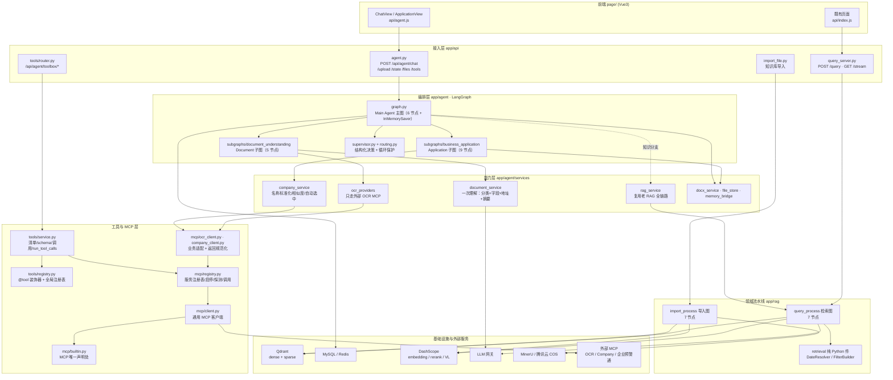

---

## 4. 图 2 · 一次请求的端到端流程

`POST /api/agent/chat` 是唯一入口，同步 / 流式 / HITL 恢复三种语义共用它。

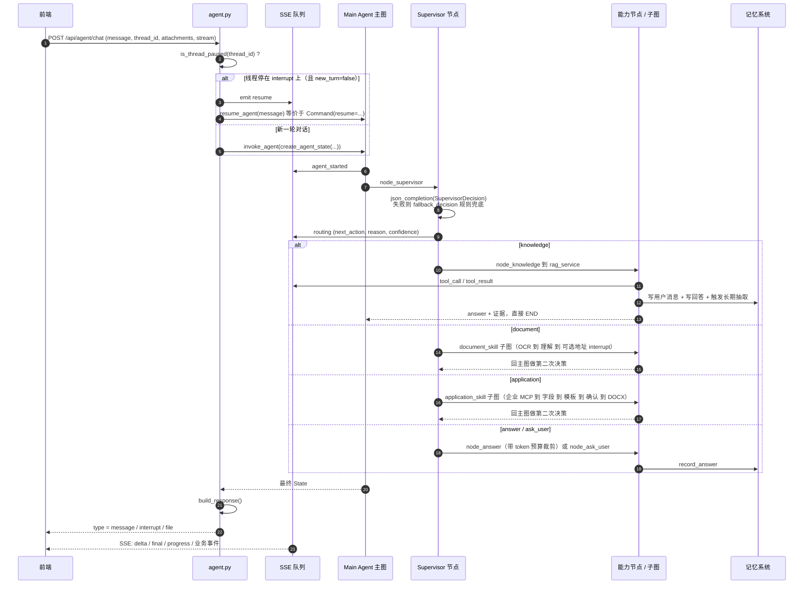

**三种返回结构**（`graph.py` 的 `build_response`）：

| `type` | 触发条件 | 前端行为 |
| --- | --- | --- |
| `message` | 默认 | 渲染文本 |
| `interrupt` | State 里有 `__interrupt__` | 展示 payload / candidates，等用户确认 |
| `file` | `generated_this_turn`（**本轮**真渲染了文件） | 渲染下载卡片；用会话级的 `generated_file_url` 判会让之后每轮都误报"已生成" |

---

## 5. 图 3 · Main Agent 主图拓扑（调用结构图）

这是整个系统最核心的一张图。**主图只有 6 个节点**，其中两个是子图：

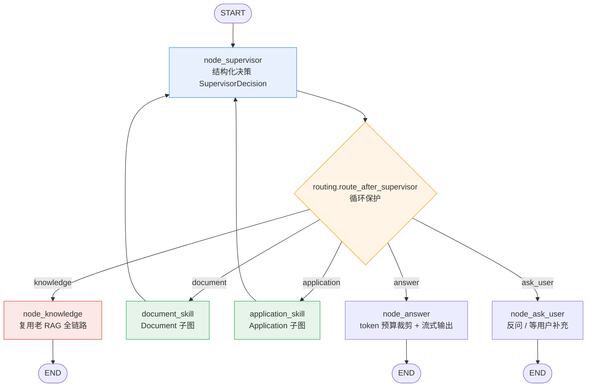

**为什么 document / application 跑完要回到 Supervisor？**
子图只产出结构化结果（文档事实、任务结果、申请书阶段）；"这些结果够不够回答用户、
还要不要再补信息"属于主 Agent 的判断，所以由 Supervisor 做第二次决策（`graph.py` 模块 docstring）。

### 5.1 两道循环保护（`routing.py`）

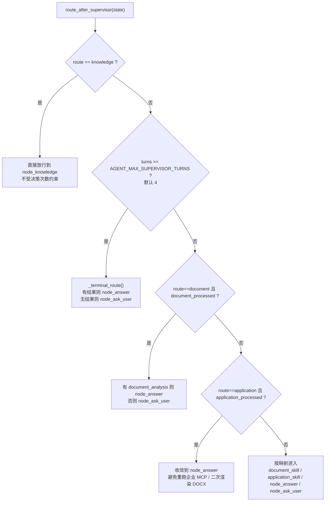

### 5.2 State 的三类字段生命周期（`state.py`）

这是最容易踩坑的地方，理解它只需要记住三条规则（`state.py` 开头说明）：

| 生命周期 | 何时变 | 典型字段 |
| --- | --- | --- |
| **请求级** | 每轮由 API 传入覆盖 | `thread_id` `user_id` `request_text` `attachments` `is_stream` |
| **轮次级** | 每轮重置（`_TURN_RESET`） | `route` `answer` `retrieved_documents` `document_processed` `application_processed` `interrupt_*` |
| **会话级** | 跨轮保留 | `document_analysis` `document_facts` `company_candidates` `selected_company` `application_data` |

> 为什么必须这么分：上一轮的 `retrieved_documents` 如果留着，路由会以为"本轮已检索过"
> 而跳过 `node_knowledge`；而 `candidate_addresses` / `company_candidates` 又恰恰要靠跨轮保留，
> 才能在"用户下一轮才回复选哪个"时把结果落回同一份 State。
>
> 另有两个实现细节：`session_id` / `original_query` / `is_stream` 三个老字段保留并镜像自
> `thread_id` / `request_text`，用于零改动复用现有检索节点；父图 State 是子图的**超集**，
> 子图只能写入父图声明过的键，否则 LangGraph 合并状态会失败。

---

## 6. 图 4 · 两个子图的内部节点拓扑

### 6.1 Document Understanding 子图（`subgraphs/document_understanding.py`）

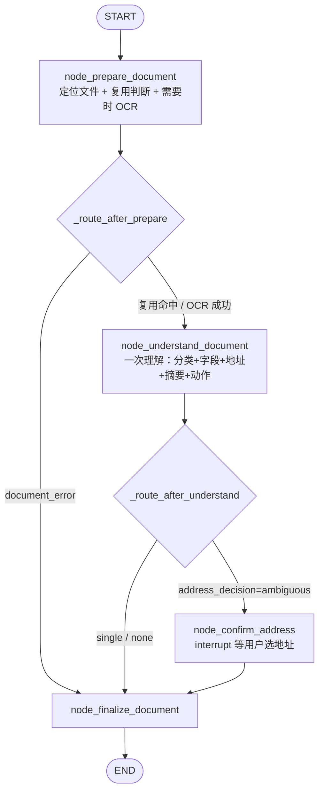

> 4 个节点。原 `node_load_document` 与 `node_run_ocr` 已合并为 `node_prepare_document`
> （两者之间只有一条"要不要真的调 OCR"的分叉，且都不含 interrupt）。
> `node_confirm_address` 必须独立：LangGraph 恢复时会重放整个中断节点。

**两个关键约定**：

1. **一次理解，全部产出**——分类 / 通用字段 / 地址候选 / 摘要在同一次模型调用里产出
   （`document_service.understand_document`）。新文件只花一次模型调用；同一份文件换任务
   （先总结、再要地址）时 `document_reuse=True`，跳过 OCR 与模型调用。
2. **地址优选是确定性规则**——`document_service.pick_mailing_address` 按
   `邮寄地址(30) > 回函地址(20) > 通讯地址(10) > 办公地址(5) > 注册地址/住所(3) > 地址(1)`
   判优先级；优先级并列时交给 `interrupt` 让用户决定，模型不参与。

**输出契约分两层**（`node_finalize_document`）：

| 层 | 含义 | 谁消费 |
| --- | --- | --- |
| `document_facts` | 文件里有什么（8 个通用字段 + 候选地址 + `raw_ref`） | 可复用；Application 子图直接消费 |
| `document_task_result` | 这次任务做得怎么样（`status` / `address_decision` / `preferred_address` / `data`） | 主 Agent 只读它决定：直接回答 / HITL / 换动作 / 转申请书 |

`status` 取值：`success` / `ambiguous` / `not_found` / `unsupported` / `failed` / `none`。
超过 v1 白名单的能力一律返回 `unsupported`，由主 Agent 决定怎么回复，**不硬抽**。

### 6.2 Business Application 子图（`subgraphs/business_application.py`）

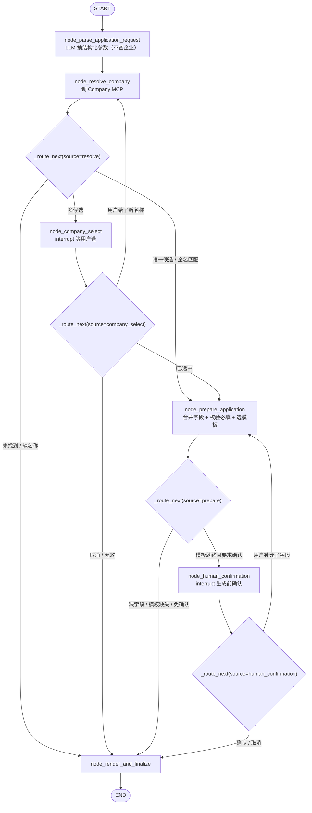

> 四个条件边共用同一个 `_route_next`，`source`（从哪个节点出来）用来区分同名阶段的不同含义
> （例如 `need_company_choice`：从 resolve 出来要进 HITL，从 company_select 出来说明用户回复
> 无效，应当收口让主 Agent 重新问，而不是原地再弹一次中断）。

> 6 个节点。原 `node_merge_document_information` + `node_collect_required_fields` +
> `node_choose_template` 合并为 `node_prepare_application`；
> 原 `node_render_docx` + `node_application_result` 合并为 `node_render_and_finalize`。
> 两个 interrupt 节点（`node_company_select` / `node_human_confirmation`）保持独立。

**自动选中规则**（`company_service.pick_company`）：只有**一个候选**，或**用户给的名称
标准化后与候选完全一致**时才自动选中（在候选里自己找那一个，不依赖排序位置）；
多候选 + 用户只报简称（如"南京XX能源"）一律走 HITL。

字段合并优先级（`node_prepare_application` 的第一段，后者覆盖前者）：
文档原始字段 → 文档事实层 → Company MCP 结果 → 用户补充 → 已有 `application_data`。

---

## 7. 图 5 · Knowledge 分支：老 RAG 检索图（7 节点）

Agent 的知识问答**不另起一条检索链路**，而是直接复用编译好的 `query_app`，
所以 `/query` 与 Agent 的知识分支跑的是**同一张编译图**，答案逐字一致。

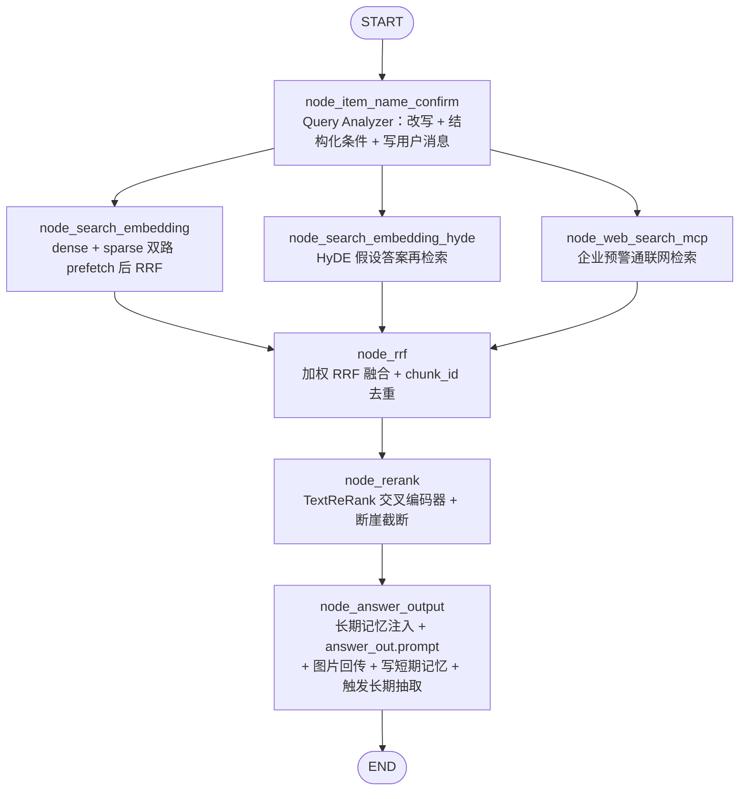

**职责边界（重要设计取舍）**：

- 大模型**只抽条件**，Python 造查询——提示词禁止模型生成 Qdrant Filter / DSL，只输出 JSON 条件；
  `RetrievalFilters` 做字段级校验，宁可不过滤退化成纯语义检索，也不带错误条件去检索。
- 大模型**不做日期算术**——模型只输出"今年上半年"这类相对表达，由 `DateResolver` 换算绝对区间。
- 精排用**交叉编码器**（TextReRank），不是 LLM。
- 断崖截断：按**绝对分差 0.5 / 相对分差 25%** 动态截 TopK（上限 12、下限 1）。
- 结构化 Filter **同时下推到 prefetch 与最外层查询**，并实现"带过滤条件却零召回时自动去过滤重查"的兜底。

---

## 8. 图 6 · 导入流水线（7 节点，串行）

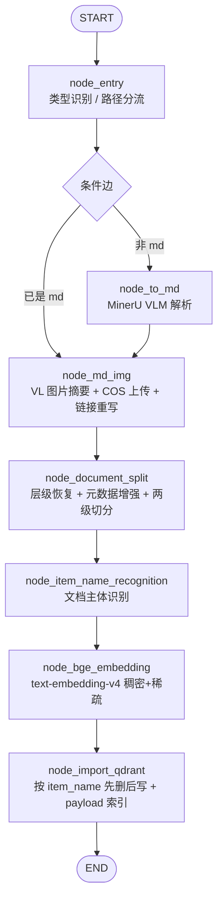

---

## 9. Tool 是怎么被调用使用的

**结论：项目里存在两套"工具"概念，用途完全不同，目前只有第一套在真实工作。**

### 9.1 第一套：业务能力（硬编码编排）—— 真正在跑

主图和子图**不使用任何工具协议**，而是节点直接 `import` 并调用 Python 服务函数：

```text
node_knowledge        → rag_service.answer_with_legacy_chain()   → 老 RAG 图
node_prepare_document → ocr_providers.run_ocr()                  → 外部 OCR MCP
node_resolve_company  → company_service.resolve_company()        → Company MCP
node_render_and_finalize → docx_service.render_application()     → DOCX
node_answer           → build_answer_prompt() + LLM 流式输出
```

调用者是**代码**，不是模型。代价是扩展能力要改图；收益是**可预测、可测试、可评测**
——能力边界清晰，不会出现"模型随手调一个工具"的不可控行为。

SSE 上的 `tool_call` / `tool_result` 事件目前**只有 `node_knowledge` 在发**
（`nodes/node_knowledge.py`），语义上更接近"能力执行埋点"，而不是真实的工具调用协议。

### 9.2 第二套：工具箱（`app/agent/tools/`）—— 已建好、尚未接入模型

这一层对标 Yuxi 的 `agents/toolkits/`，解决"有哪些工具、谁能用、怎么被调用"：

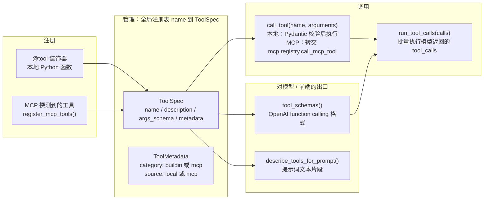

**五个文件，各管一件事**：

| 文件 | 职责 | 关键 API |
| --- | --- | --- |
| `mcp/builtin.py` | MCP 声明（唯一配置处） | `BUILTIN_MCP_SERVERS` / `resolve_url` / `resolve_api_key` |
| `tools/registry.py` | 本地工具注册与描述 | `@tool` / `register_tool` / `get_tool` / `get_tool_metadata` |
| `mcp/registry.py` | MCP 服务注册表 | `register_server` / `list_servers` / `set_server_enabled` / `server_tools` / `call_mcp_tool` |
| `tools/service.py` | 对外统一入口 | `list_tools` / `tool_schemas` / `call_tool` / `register_mcp_tools` / `run_tool_calls` |
| `tools/router.py` | HTTP 管理接口 | `/api/agent/toolbox/*` |

**内置工具只有 4 个纯功能性小工具**（`tools/buildin.py`）：`calculator`（AST 安全求值，
不用 `eval`）、`current_time`、`text_stats`、`random_pick`。
业务能力**刻意不进工具箱**，避免同一件事出现两个 Owner。

**MCP 工具注册命名**沿用 Yuxi 写法：`mcp__<服务slug>__<工具名>`
（例如 Company MCP 的检索工具注册为 `mcp__company__search_company`）。

**调用约定**：失败不抛异常，统一返回 `{"ok": false, "error": ...}` 信封，接口不会变成 500。

> ⚠️ **关键发现**：`describe_tools_for_prompt()` 与 `run_tool_calls()` 目前**没有任何调用方**
> （全仓库搜索只命中定义处与 `tools/__init__.py` 的导出）。也就是说——
>
> **当前版本的大模型并不会自己选工具、发 tool_calls。**所有"能力选择"都由
> `SupervisorDecision` 的结构化决策 + LangGraph 条件边完成。工具箱是**为下一步准备的接口层**，
> 接上只需要一步：把 `describe_tools_for_prompt()` 拼进提示词，再把模型返回的 `tool_calls`
> 交给 `run_tool_calls()`——不需要动图结构。`docs/agent-framework.md` 也把它列为"下一步建议 2"。

---

## 10. MCP 是怎么被调用使用的

### 10.1 配置哲学：声明在代码，密钥在 `.env`

`mcp/builtin.py` 是**唯一配置处**，每个服务一条声明：

```python
BUILTIN_MCP_SERVERS = {
    "ocr": {
        "name": "OCR MCP",
        "transport": "streamable_http",   # 或 sse
        "url": "",                        # 地址直接写这里
        "url_env": "OCR_MCP_BASE_URL",    # 留空时回退读这个环境变量
        "api_key_env": "OCR_MCP_API_KEY", # 密钥只写变量名，不进仓库
        "auth_header": "x-api-key",
        "timeout": 30.0,
        "enabled": True,
        "tools": {"recognize": "GeneralOcrRecognition"},   # 语义名 到 服务端真实工具名
        "adapter": {"input_mode": "url", "args_template": {"pictureUrl": "{file_url}"}},
    },
    "company": {...},
    "yjt": {...},
}
```

换厂商、加服务、改工具名、改入参形态，都只改这一个文件。
`.env` 只剩两件事：**密钥** 和 **可选的地址覆盖**（本地联调 / CI 用）。

### 10.2 MCP 调用结构图

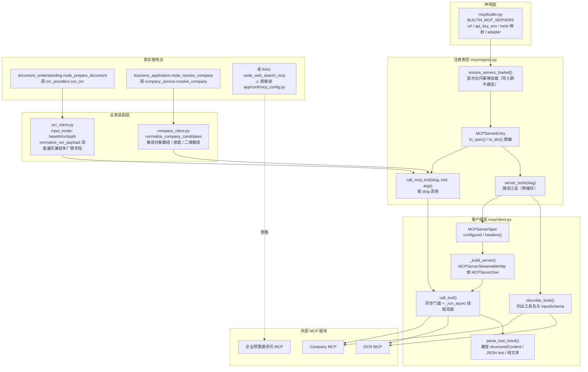

### 10.3 三个 MCP 的差异化使用

| MCP | 语义工具名 | 真实工具名（默认） | 入参形态 | 被谁调用 |
| --- | --- | --- | --- | --- |
| OCR | `recognize` | `GeneralOcrRecognition` | `adapter.input_mode`：`base64` / `url` / `path`，可用 `args_template` 覆盖字段名；`url` 形态会先把附件传到 COS 换公网地址（`file_store.public_url`） | Document 子图 `node_prepare_document` |
| Company | `search` | `search_company` | `{query, limit, **args_template}` | Application 子图 `node_resolve_company` |
| 企业预警通 | `search_news` | `search_news` | — | **旁路**：老 RAG `node_web_search_mcp` 直接读 `app/conf/mcp_config.py` |

**OCR 只保留一个通用能力（方案 A）。** 该 MCP 一共暴露 8 个工具（通用 OCR + 银行卡 / 身份证 /
车牌 / 驾驶证 / 行驶证 / 增值税发票 / 火车票），它们入参形态还不一样（通用是 `pictureUrl`，
其余是 `image_url` + `imageUrl`）。因此：

- 业务链路只用 `GeneralOcrRecognition` 一条，声明里也只登记 `recognize` 这一个语义名；
- `tools` 是语义别名表而非白名单，没登记的工具不会被禁用，工具箱仍会列出；
- 想临时调别的工具走 `POST /api/agent/toolbox/call`（`mcp__ocr__<真实工具名>`），
  或在声明里加 `disabled_tools` 把它们挡在工具箱外；
- 将来要真的支持多工具，需要把 `adapter`（input_mode / args_template）从服务级下沉到工具级，
  现在做不到"一个 adapter 描述多个工具"。

**`url` 形态的附件交换方式**（`file_store.public_url`，实测踩过两个坑）：

| 环节 | 做法 | 踩过的坑 |
| --- | --- | --- |
| 外链 | COS **签名 URL**（`get_presigned_url`，默认 600s） | 桶默认私有，裸对象地址会 `403 AccessDenied`；而外部服务遇到 403 时回的是"请求超时"，极难定位 |
| 缓存 | `meta.json` 记 `cos_key` / `public_url` / 过期时间 | 签名会过期，缓存不看有效期就会拿旧链接去调 |
| 自检 | 生成后先自己 GET 一次（`_url_reachable`） | 拉不通就直接报错，不让外部服务那边表现成含糊的超时 |

**厂商返回信封**：该厂商 HTTP 200 但 body 可能是 `{"success": false, "code": "TIMEOUT_ERROR"}`，
失败不能当成"识别到 0 字"。`ocr_client._find_error` 负责识别这类信封并抛错（→ `ocr_failed`）。

### 10.4 两条纪律与降级矩阵

**纪律一：导入期不建连。** 只有 `server_tools()`（探测）和 `call_mcp_tool()`（调用）才会真的连，
失败只记日志并返回空结果。

**纪律二：只给脱敏信息。** `MCPServerEntry.to_dict()` 不含 `api_key`，调试接口不会漏密钥。

**降级矩阵**（除 OCR 外，MCP 没配好也能跑通全流程）：

| 环节 | 有 MCP | 没有 MCP |
| --- | --- | --- |
| OCR | 调外部 OCR MCP；`url` 入参形态先把附件传 COS 换公网地址 | **没有本地兜底**：未配置 → `ocr_unavailable`（反问用户）；配了但调用失败 → `ocr_failed`（带原始报错） |
| 企业信息 | 调外部 Company MCP | 明确返回"未找到匹配企业"，引导补全名称或上传营业执照，**绝不猜** |
| 文档语义 | 大模型 | 退化为关键词分类 + 正则抽取 |
| 回答生成 | 大模型 | 反问 / 兜底文案，不编造事实 |

**会话附件只收图片（PNG / JPEG）。** 文档解析走 OCR MCP，而它的入参是"图片链接"，
PDF / Word 需要用户先转图：

- 前端：`accept=".png,.jpg,.jpeg"` + 选文件时立刻提示"请上传图片格式（PNG / JPEG）以供解析"
- 后端：`POST /api/agent/upload` 再兜一道，非图片返回 `415` 并带上同样口径的原因
- 因此 `AGENT_OCR_PAGES_LIMIT` 与 OCR 的「按页识别」参数一并移除（单张图片没有页的概念）

### 10.4.1 执行记录（PostgreSQL）

每轮对话落一行到 `agent_run` 表（`app/agent/services/execution_store.py`）：
谁、问什么、带了什么附件、调了哪些能力、结果如何、耗时多少、报了什么错。

| 项 | 位置 |
| --- | --- |
| 连接配置 | `.env` 的 `PG_DSN`（优先）或 `PG_HOST / PG_PORT / PG_USER / PG_PASSWORD / PG_DATABASE`，见 `app/conf/pg_config.py` |
| 建表 | 首次写入时自动 `CREATE TABLE IF NOT EXISTS agent_run`（不需要手工建表） |
| 写入时机 | `api/agent.py::_run_agent` 的 `finally`，每轮必写（含失败与 HITL 中断） |
| 查询 | `GET /api/agent/runs?limit=20&thread_id=...` |
| 降级 | 没配 PG / 连不上 / 写失败 → 只记日志，**绝不影响本轮返回** |

**检查点用 sqlite**，与上面的执行记录库分开：`AGENT_CHECKPOINT=sqlite:output/agent_state.db`，
文件在项目 `output/` 下，重启不丢、支持同机跨进程 HITL 恢复；不配则退回 `memory`。

### 10.5 厂商兼容性设计（换 MCP 厂商只改一个文件）

| 环节 | 兼容手段 | 位置 |
| --- | --- | --- |
| 工具名 | `tools: {语义名: 真实名}` 映射 | `builtin.py` |
| 入参形态 | `adapter.input_mode`（base64/url/path）+ `adapter.args_template` 占位符覆盖 | `builtin.py` → `ocr_client.build_ocr_arguments` |
| 返回结构 | 深度优先遍历 + 多字段别名匹配 | `ocr_client.normalize_ocr_payload`（`full_text/fullText/text/markdown/content` 等）、`company_client.normalize_company_candidates` |
| 传输方式 | `transport: streamable_http / sse` | `client._build_server` |

---

## 11. 大模型是怎么编排的

### 11.1 编排范式：不是自主 Agent，是"图上单点调用"

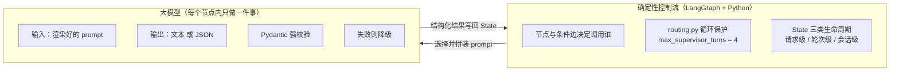

**关键取舍**：项目**不用 LangChain 的 `with_structured_output` / function calling**。
原因是模型走 OpenAI 兼容网关（DeepSeek / 千问），function calling 支持程度不一致；
而现有链路（Query Analyzer）已经验证了「`json_mode` + 提示词约束 + Pydantic 校验」这条路。
封装在 `app/agent/llm.py`：

```text
json_completion(schema, prompt, fallback=None, tag="agent") -> Optional[T]
    1. get_llm_client(json_mode=True) 然后 invoke
    2. 剥掉模型偶尔带的围栏（_strip_code_fence）
    3. json.loads 然后 schema.model_validate
    4. 任一环节失败则返回 fallback，由调用方决定降级策略

text_completion(prompt, tag) -> str   普通文本补全，失败返回空串
```

### 11.2 大模型调用点全景（按业务链路分组）

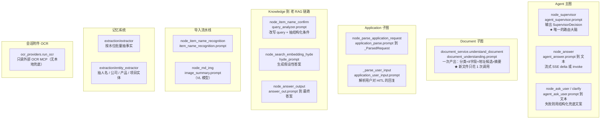

### 11.3 各调用点的输入 / 输出 / 降级

| 调用点 | 提示词 | 输出结构 | 失败降级 |
| --- | --- | --- | --- |
| `supervisor.decide` | `agent_supervisor.prompt` | `SupervisorDecision`（5 类路由 + `document_action` + `confidence`） | `fallback_decision` 规则兜底，仍保证"有附件先理解、有证据先回答、缺信息就反问" |
| `node_answer` | `agent_answer.prompt` | 自然语言 | `_needs_clarification` 分支走结构化文案，不调模型 |
| `clarify.compose_clarification` | `agent_ask_user.prompt` | 反问话术 | 直接用 `build_situation(state)` 的结构化描述 |
| `document_service.understand_document` | `document_understanding.prompt` | `DocumentUnderstanding` | `_rule_understand`：关键词分类 + 正则字段 + 正则地址 + 前 200 字摘要（**整体退化**，不出现半截状态） |
| `application._UserInput` | `application_user_input.prompt` | `_UserInput` | `_rule_parse_user_input` 规则解析 |
| `node_item_name_confirm` | `query_analyzer.prompt` | `rewritten_query` + `filters` JSON | 非 JSON 输出则降级为原问题检索 |
| `node_answer_output` | `answer_out.prompt` | 最终答案（带 `source/title/score` 引用） | — |

### 11.4 大模型**不做**什么（职责边界）

这是本项目最值得强调的设计。以下五件事**全部由 Python 完成**，模型无权参与：

| 事项 | 模型的角色 | Python 的实现 |
| --- | --- | --- |
| 日期算术 | 只输出相对表达（"今年上半年""最近三个月"） | `retrieval/date_resolver.py` 换算绝对区间（今天/昨天/本周/上月/近 N 天/季度/年份，兼容中文数字） |
| 构造 Qdrant Filter | 只输出 JSON 条件，提示词明确禁止生成 DSL | `retrieval/qdrant_filter_builder.py` 字段级校验（格式归一化、枚举白名单、非法值丢弃、区间写反自动交换） |
| 选邮寄地址 | 只抽候选地址与标签 | `document_service.pick_mailing_address` 按优先级表判定；并列则 `interrupt` |
| 企业事实 | 只读不产 | 只允许来自 Company MCP 或 `document_facts`；未匹配就明说"未找到"，**绝不猜** |
| 重复调用防抖 | 无权决定循环次数 | `routing.py` 的两道循环保护 + `max_supervisor_turns` |

### 11.5 Token 预算总控

模型编排的另一半是"喂多少上下文"。项目有三层独立预算（都走 `app/utils/token_budget.py`）：

| 位置 | 预算 | 策略 |
| --- | --- | --- |
| `node_answer` | `answer_config.available_input_budget` | 把工具结果组装成**条目列表**（不提前拼大字符串），超额按"长期记忆 → 最旧历史 → 最低分文档"**整条丢弃** |
| Query Analyzer | 8000 token | 从最旧一条开始裁剪短期记忆 |
| 长期记忆抽取 | 上下文 4000 / 参考 2000 | 按 token 预算裁剪后再送抽取模型 |

用 `tiktoken`（`cl100k_base`）计数，离线环境降级为中英文字符估算器。
回答链路默认在 32000 token 总预算内竞争（预留 3000 输出 + 1500 安全缓冲）。

### 11.6 HITL 的编排方式

中断点共 4 处，全部用 LangGraph 原生 `interrupt()` + `Command(resume=...)`：

| 中断点 | 位置 | 触发条件 |
| --- | --- | --- |
| 企业多候选 | `business_application.node_company_select` | 多候选且用户只给简称 |
| 生成前确认 | `business_application.node_human_confirmation` | `AGENT_REQUIRE_CONFIRM_BEFORE_RENDER=true` |
| 地址歧义 | `document_understanding.node_confirm_address` | 同优先级多个地址 |
| 缺字段 | `node_prepare_application` → `node_render_and_finalize` | 必填字段缺失（最多补 2 轮） |

**恢复机制**：`is_thread_paused(thread_id)` 读 checkpointer 的 `snapshot.next` 判断线程是否停在
中断上；下一轮 `POST /api/agent/chat` 只要没显式传 `new_turn=true`，`message` 会被自动当作
`Command(resume=...)` 的值。**注意 checkpointer 目前是 `InMemorySaver`（进程内）**。

### 11.7 SSE 事件协议

旧事件（`progress` / `delta` / `final` / `error`）保持不变，Agent 新增 13 个业务事件，
旧前端会直接忽略不认识的事件：

```text
agent_started · routing · tool_call · tool_result · agent_message
document_processing · ocr_completed
company_candidates · human_confirmation_required
template_selected · document_generating · document_ready · resume
```

---

## 12. 图 7 · 记忆系统调用链

Agent 与 `/query` **共用同一套记忆实现**，靠 `services/memory_bridge.py` 桥接，不走第二套代码。

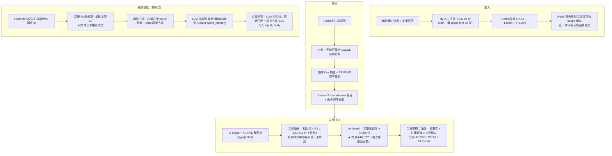

三层结构：**L1 短期（会话）** / **L2 长期（跨对话）** / **L3 实体辅助索引**。
所有操作统一以 `scope`（`user:{id}` / `agent:{id}` / `run:{session_id}`）隔离，
禁止仅凭 `memory_id` 跨租户访问。

---

## 13. 值得注意的问题与风险

按"实际影响"排序，都是读代码时能直接看到的：

### 13.1 工具箱与提示词未打通（设计意图与现状的差）

`describe_tools_for_prompt()` / `run_tool_calls()` 没有调用方，模型不会自己选工具。
`tools/__init__.py` 的模块 docstring 还写着"内置工具（知识库问答 / 企业检索 / 文档识别）"，
但 `buildin.py` 里实际只有 4 个通用小工具——**docstring 与实现不一致**，容易误导后续开发。

### 13.2 MCP 配置有两个来源

`yjt`（企业预警通）虽然登记在 `builtin.py` 里，但老 RAG 的 `node_web_search_mcp`
**仍然直接读 `app/conf/mcp_config.py`**（`builtin.py` 的注释也承认了这点）。
于是"改一个文件就能换厂商"这个承诺对 `yjt` 并不成立；同一份能力有两处配置，排障时容易只改一处。

### 13.3 checkpointer 是 `InMemorySaver`

HITL 与多轮 State 都存在进程内存里：**进程重启或多进程部署（uvicorn workers > 1）会丢状态**，
恢复请求可能落到没有该 thread 的进程上。换 Redis/MySQL checkpointer 只需替换
`build_agent_graph(checkpointer=...)` 的参数，图结构不用动——但这件事目前还没做。

### 13.4 `document_service.py` 有死代码

`classify_document` / `extract_fields` / `extract_addresses` / `generate_summary` 这四个
细粒度函数**已无调用方**（子图只调 `understand_document`），但模块 docstring 仍在描述它们，
且对应的提示词（`document_classify` / `document_extract` / `document_address` / `document_summary`）
仍留在 `prompts/`。属于"改造前"遗留，建议标注为可回退路径或直接删除。

### 13.5 反问有两条输出路径

`node_ask_user`（走 `compose_clarification` 调模型）与 `node_answer` 的 `_needs_clarification`
分支（`application_phase in {need_user_input, cancelled, error}` 或
`document_task_result.status in {ambiguous, unsupported, not_found, failed}`）都能输出反问。
两条路径的文案风格与是否调模型不同，行为一致但实现重复。

### 13.6 其他

- `app/rag/mcp/` 目录为空（占位）。
- `.env` 已被 `.gitignore` 忽略且未被 git 跟踪，密钥管理方式正确。
- 工作区有大量未提交改动（`app/agent/` 整个目录为 untracked），说明当前处于改造进行中，
  review 时应以工作区代码而非 `main` 分支为准。
- `page/dist/` 是已构建产物且被 gitignore；前端接线状态需以 `page/src/api/agent.js` 是否被
  `ChatView` 引用为准。

---

## 14. 快速上手

```bash
# 离线自检（不联网、不依赖 MySQL/Qdrant）
PYTHONPATH=. python app/test/test_agent_framework.py    # 8 项，含 HITL 恢复全链路
PYTHONPATH=. python app/test/test_tool_registry.py      # 8 项，含 MCP 工具注册与调用

# OCR MCP 能不能用（唯一的 OCR 通路，--online 才联网）
PYTHONPATH=. python app/test/test_mcp_ocr_demo.py               # 打印配置 + 离线自检
PYTHONPATH=. python app/test/test_mcp_ocr_demo.py --online      # 真连一次，输出识别文本

# 只跑 Document 子图（不经过 Supervisor）
PYTHONPATH=. python scripts/run_document_subgraph.py --mermaid
PYTHONPATH=. python scripts/run_document_subgraph.py --task "提取邮寄地址" --text-file 询证函.txt
PYTHONPATH=. python scripts/run_document_subgraph.py --task "提取邮寄地址" --file 询证函.png
PYTHONPATH=. python scripts/run_document_subgraph.py --thread t1 --task "总结" --reuse   # 同一份文件换任务

# 健壮性自检（OCR 失败三态 / COS 外链生命周期 / 复用轮动作判定）
PYTHONPATH=. python app/test/test_document_robustness.py
# 执行记录自检（PostgreSQL，离线用假连接验证 SQL 与降级行为）
PYTHONPATH=. python app/test/test_execution_store.py

# 启动服务（默认 127.0.0.1:8001）
python -m app.api.query_server

# 执行记录（PostgreSQL）：确认配置是否生效，最近 20 条
curl "http://127.0.0.1:8001/api/agent/runs?limit=20" | python -m json.tool

# 对齐 MCP 工具名
curl "http://127.0.0.1:8001/api/agent/tools?probe=true" | python -m json.tool
curl "http://127.0.0.1:8001/api/agent/toolbox/mcp?probe=true" | python -m json.tool

# 走一次文档理解
curl -F "files=@询证函.jpg" http://127.0.0.1:8001/api/agent/upload
curl -X POST http://127.0.0.1:8001/api/agent/chat -H "Content-Type: application/json" \
     -d '{"thread_id":"t1","message":"帮我提取邮寄地址","attachments":[{"file_id":"file_xxx"}]}'

# Agent 评测（offline 为规则基线；去掉 --offline 需要模型）
PYTHONPATH=. python -m evaluation.agent.run_agent_eval --suite all --offline
```

### 接口一览

| 方法 | 路径 | 说明 |
| --- | --- | --- |
| POST | `/api/agent/chat` | 统一入口（同步 / 流式 / HITL 恢复） |
| POST | `/api/agent/upload` | 会话附件上传，返回 `file_id` |
| GET | `/api/agent/stream/{thread_id}` | SSE 长连接 |
| GET | `/api/agent/state/{thread_id}` | 查看线程 State（调试 HITL / 多轮上下文） |
| GET | `/api/agent/files/{name}` | 下载生成的 DOCX |
| GET | `/api/agent/tools` | MCP / 模板配置自检（`?probe=true` 实际连一次） |
| GET | `/api/agent/toolbox` | 工具清单（`?category=buildin` / `mcp`） |
| GET | `/api/agent/toolbox/schema` | 工具描述（OpenAI 格式，`?include_mcp=true`） |
| POST | `/api/agent/toolbox/call` | 按名调用工具 |
| GET | `/api/agent/toolbox/mcp` | MCP 服务清单（脱敏，`?probe=true` 探测） |
| POST | `/api/agent/toolbox/mcp/{slug}/enable` | 启用 / 停用某个 MCP 服务 |
